# Multi-Agent Music Intelligence System

## Agent Architecture

```mermaid
graph TD
    Start([User Query]) --> Init[Initialize]
    Init --> Orch[🧑‍✈️ Orchestrator<br/>Parse intent & context]
    Orch --> Memory[🧬 Memory Agent<br/>Load user profile]
    
    Memory --> Parallel{Parallel Execution}
    
    Parallel --> Taste[🎯 Taste DJ<br/>Familiar recommendations]
    Parallel --> Explorer[🧪 Chaos DJ<br/>Novel discoveries]
    
    Taste --> Merge[Merge Candidates]
    Explorer --> Merge
    
    Merge --> Safety[🛡️ Safety Agent<br/>Content policy checks]
    
    Safety --> Review{Needs Review?}
    Review -->|Yes| Human[👤 Human Review]
    Review -->|No| Critic[🧑‍⚖️ Critic<br/>Rerank & curate]
    Human --> Critic
    
    Critic --> Explain[🌈 Storyteller<br/>Generate explanation]
    
    Explain --> Done[Final Playlist]
    Done --> End([Return to User])
    
    style Orch fill:#4a90e2
    style Memory fill:#7b68ee
    style Taste fill:#50c878
    style Explorer fill:#ff6b6b
    style Safety fill:#ffd700
    style Critic fill:#ff8c42
    style Explain fill:#9b59b6
```



## Agent Responsibilities

### 🧑‍✈️ Orchestrator Agent
- **Role**: Brain of the system
- **Input**: User query
- **Output**: Parsed intent, session context, preferences
- **Key Actions**:
  - NL → structured intent
  - Extract activity, duration, mood
  - Set workflow parameters

### 🧬 Memory Agent  
- **Role**: Persistent state manager
- **Input**: User ID
- **Output**: Long-term taste profile
- **Maintains**:
  - Liked/disliked songs
  - Preferred genres, artists, moods
  - Listening history
- **Updates**: On every feedback action

### 🎯 Taste DJ (Recommender)
- **Role**: Safe bets that match taste
- **Strategy**: 
  - High weight on known preferences
  - Artist familiarity boost
  - Genre/mood matching
- **Output**: ~70% of playlist (familiar tracks)

### 🧪 Chaos DJ (Explorer)
- **Role**: Push out of comfort zone
- **Strategy**:
  - Filter out known artists
  - Find adjacent genres
  - High novelty scoring
- **Output**: ~30% of playlist (discoveries)

### 🛡️ Safety Agent
- **Role**: Content guardrails
- **Checks**:
  - Explicit content filter
  - Language preferences
  - User-defined rules
- **Authority**: Can drop tracks, log reasons

### 🧑‍⚖️ Critic Agent
- **Role**: Final curator & judge
- **Multi-objective scoring**:
  - Intent alignment
  - Novelty vs familiarity balance
  - Session context matching
  - Artist diversity
- **Output**: Final ranked playlist

### 🌈 Storyteller (Explainer)
- **Role**: Human-friendly explanations
- **Input**: Final playlist + agent logs
- **Output**: Engaging 2-3 sentence summary
- **Capability**: Per-song "why" answers

### 📊 Feedback Agent
- **Role**: Learning & adaptation
- **Triggers**: Like/dislike/skip actions
- **Updates**:
  - User profile
  - Novelty tolerance
  - Genre/artist preferences

## State Flow

```
AppState {
    user_id: str
    query: str
    intent: recommend | explain | update_prefs
    preferences: {genres, artists, moods, size, novelty_tolerance}
    session_context: {activity, duration, mood}
    candidate_tracks: [CandidateTrack]  # from multiple agents
    final_playlist: [Song]
    explanations: [str]
    logs: [AgentLog]  # full trace
    requires_human_review: bool
}
```

## Key Features Demonstrated

### ✅ Multi-Agent Coordination
- Orchestrator routes workflow
- Parallel execution (Taste + Explorer)
- Agent specialization (taste vs novelty)

### ✅ Persistent Memory
- User profile stored across sessions
- Feedback loop updates preferences
- Online learning from interactions

### ✅ Human Oversight
- Optional review node
- Feedback-driven adjustments
- Explainable decisions (full log trace)

### ✅ Advanced LangGraph Features
- TypedDict state with Annotated fields
- Conditional routing (review, error handling)
- Parallel branches (simulated)
- Stateful checkpointing (memory)

### ✅ Tracing & Debuggability
- AgentLog captures every decision
- Per-track reasoning stored
- Graph visualization via mermaid
